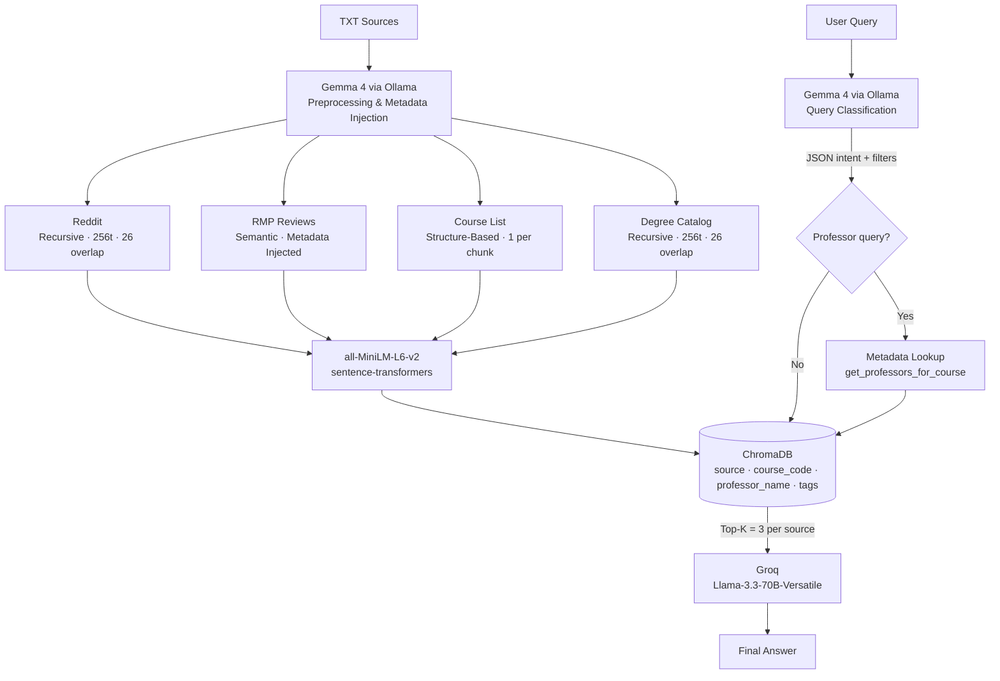

# Project 1 Planning: The Unofficial Guide

> Write this document before you write any pipeline code.
> Your spec and architecture diagram are what you'll use to direct AI tools (Claude, Copilot, etc.) to generate your implementation — the more specific they are, the more useful the generated code will be.
> Update the Retrieval Approach and Chunking Strategy sections if you change your approach during implementation.
> Update this file before starting any stretch features.

---

## Domain

<!-- What domain did you choose? Why is this knowledge valuable and hard to find through official channels? -->
I chose student reviews of CS professors and courses at University of the People. This knowledge is valuable because 
students can benefit from these reviews to anticipate the difficulty level of courses before they start. This knowledge 
is also hard to find through official channels as University of the People is an online school that is very different
from traditional colleges. Each term you might end up with different classmates, which makes socialization hard and 
therefore knowledge sharing in terms of courses / professors is limited to platforms like Reddit or RateMyProfessor which
not all students use.

---

## Documents

<!-- List your specific sources: URLs, subreddit names, forum threads, or file descriptions.
     Aim for at least 10 sources that together cover different subtopics or perspectives within your domain. -->
For this occasion, I'll be working with .txt documents stored locally. This helps me avoid complicated processes like
web scraping or extracting text from unstructured PDF files.

| #  | Source                             | Description                                                                                                                   | URL or location                                                      |
|----|------------------------------------|-------------------------------------------------------------------------------------------------------------------------------|----------------------------------------------------------------------|
| 1  | RateMyProfessor                    | Reviews for Computer Science Professor Alejandro                                                                              | /documents/ratemyprofessor/alejandro.txt                             |
| 2  | RateMyProfessor                    | Reviews for Computer Science Professor Andrea                                                                                 | /documents/ratemyprofessor/andrea.txt                                |
| 3  | RateMyProfessor                    | Reviews for Computer Science Professor Cecil                                                                                  | /documents/ratemyprofessor/cecil.txt                                 |
| 4  | RateMyProfessor                    | Reviews for Computer Science Professor Charles                                                                                | /documents/ratemyprofessor/charles.txt                               |
| 5  | RateMyProfessor                    | Reviews for Computer Science Professor Matthew                                                                                | /documents/ratemyprofessor/matthew.txt                               |
| 6  | RateMyProfessor                    | Reviews for Computer Science Professor Mudasir                                                                                | /documents/ratemyprofessor/mudasir.txt                               |
| 7  | RateMyProfessor                    | Reviews for Computer Science Professor Romana                                                                                 | /documents/ratemyprofessor/romana.txt                                |
| 8  | RateMyProfessor                    | Reviews for Computer Science Professor Ubaid                                                                                  | /documents/ratemyprofessor/ubaid.txt                                 |
| 9  | RateMyProfessor                    | Reviews for Computer Science Professor William                                                                                | /documents/ratemyprofessor/william.txt                               |
| 10 | Reddit (r/uopeople)                | Reddit post on which CS courses where the most difficult per personal experiences.                                            | /documents/reddit/cs_classes_you_found_them_difficult.txt            |
| 11 | Reddit (r/uopeople)                | Reddit post on which CS courses where the most difficult per personal experiences.                                            | /documents/reddit/how_to_make_the_most_out_of_your_bachelor_in.txt   |
| 12 | Reddit (r/uopeople)                | Reddit post from alumni with tips and tricks on how to make the most out of a CS degree at UoPeople.                          | /documents/reddit/what_were_your_most_difficult_computer_science.txt |
| 13 | University of the People's Catalog | Official UoPeople document with information about the CS degree such as degree description, prerequisites, learning pathways. | /documents/uop/bscs_uopeople_catalog.txt                             |
| 14 | University of the People's Catalog | Official UoPeople document with a list of CS courses, their description and prerequisites.                                    | /documents/uop/courses_in_computer_science.txt                       |

---

## Chunking Strategy

<!-- How will you split documents into chunks?
     State your chunk size (in tokens or characters), overlap size, and explain why those
     numbers fit the structure of your documents.
     A review-heavy corpus warrants different chunking than a long FAQ. -->

I have 3 different categories (or sources) of documents. Each category comes with different content structure which means
each category needs a different chunking strategy.

- #### RateMyProfessor reviews
    For these reviews I will use **semantic** chunking. Semantic chunking is the best option, in my opinion, as each student 
review is a different semantic unit, so the topic boundary is clear. 
  
    The challenge to solve with semantic chunking is context loss. The professor information is only found at the beginning 
of each document. So usually reviews don't mention the professor name at all. A good approach to fix this is to inject
metadata to each review before chunking. The metadata would include, at the very least, the professor name and their rating.
  
    For this semantic approach I won't need to configure a specific chunk size or overlap.

- #### Reddit posts
    Reddit posts very in terms of length and comments. Some posts don't include body, just a title, while others have a long,
detailed body. Comments vary in character length, as well as hierarchy, as some posts include nested replies.
  
    For these posts I will be using a **recursive** approach. The reasoning behind using recursive chunking for this category,
is to try and preserve the natural boundaries of posts and comments. Recursive chunking should respect natural boundaries
for posts and comments. Which means it should be able to handle long posts and short comments gracefully. For Reddit posts
I will use a **chunk size of 256 tokens**, with an **overlap of 26 tokens**.

  - #### UoPeople Catalog
      For documents from the UoPeople catalog I will be using a hybrid approach. I have two different documents: one is a long
      document with a list of all the CS courses, and the other one is a more descriptive document that includes information
      about the degree, learning pathways, prerequisites, etc.
    
      For the course list, I will use a **structure-based** chunking. With this approach, I will be treating each course as one 
      chunk unit. For this approach I don't need to set a specific chunk size or overlap.
        
      Now for the other document, I will use **recursive** chunking. The idea is to try to preserve units like 
      "learning pathways" as  one chunk.  I will be using a **chunk size of 256 tokens** with an **overlap of 26 tokens**. 
      A token size in recursive chunking is used to ensure that chunks don't exceed  this size, so in the end I might 
      end up getting chunks of different sizes, but never greater than 256 tokens.

---

## Retrieval Approach

<!-- Which embedding model are you using (e.g., all-MiniLM-L6-v2 via sentence-transformers)?
     How many chunks will you retrieve per query (top-k)?
     If you were deploying this for real users and cost wasn't a constraint, what tradeoffs
     would you weigh in choosing a different embedding model — context length, multilingual
     support, accuracy on domain-specific text, latency? -->

**Embedding model:** all-MiniLM-L6-v2 via sentence-transformers

**Top-k:** I will retrieve 3 chunks per query.

**Production tradeoff reflection:** If cost wasn't a constraint, I would evaluate different embedding models. For 
example, all-MiniLM-L6-v2 is a simple model with a 256 token maximum capacity. Assuming eventually I will handle larger
documents, a model with a higher maximum token capacity could be useful. I could also consider a model trained on 
domain-specific text, rather than a generalist model. A model with multilingual support could be useful as well. Given
that University of the People is a college with students from all around the world, there might be additional resources
in different languages, or real users could ask questions in their native languages. 

---

## Evaluation Plan

<!-- List your 5 test questions with their expected correct answers.
     Questions should be specific enough that you can judge whether the system's response
     is right or wrong. "What are good dining halls?" is too vague.
     "What do students say about wait times at [dining hall name] during lunch?" is testable. -->

| # | Question                                                            | Expected answer                                                                                                                                                                                                                                                                                                                                               |
|---|---------------------------------------------------------------------|---------------------------------------------------------------------------------------------------------------------------------------------------------------------------------------------------------------------------------------------------------------------------------------------------------------------------------------------------------------|
| 1 | Are there any courses on databases in this degree?                  | Yes, in this degree you will find Databases 1 and Databases 2 which cover everything related to databases. Source: courses_in_computer_science.txt                                                                                                                                                                                                            |
| 2 | Has anyone ever encountered any professors that good give feedback? | Yes, many students have noted that professors such as Alejandro, Andrea, and William give good feedback. Source: alejandro.txt, andrea.txt, william.txt                                                                                                                                                                                                       |
| 3 | What is CS4407 about?                                               | CS4407, also known as Data Mining and Machine Learning, is a proctored course that covers machine learning, knowledge discovery, and data mining. Source: courses_in_computer_science.txt, bscs_uopeople_catalog.txt                                                                                                                                          |
| 4 | Is CS2204 a difficult course?                                       | CS2204 is considered to be a difficult course per some students. Reviews for professors that have taught this course have an average of 3.5/5 for difficulty. Source: cs_classes_you_found_them_difficulty.txt, cecil.txt                                                                                                                                     |
| 5 | Are there any tips for passing CS1102?                              | CS1102, also known as Programming 2, is a course that covers Java beyond its basic concepts. Students have recommended watching YouTube tutorials as the textbook quality is low, another useful tip is to go through the Oracle docs to expand your knowledge in Java. Source: courses_in_computer_science, how_to_make_the_most_out_of_your_bachelor_in.txt |

---

## Anticipated Challenges

<!-- What could go wrong? Name at least two specific risks with reasoning.
     Consider: noisy or inconsistent documents, missing source attribution, off-topic
     retrieval, chunks that split key information across boundaries. -->

1. Missing source attribution. I have content spread across different documents, so I suspect it is possible that the LLM could fail at identifying the right source(s).

2. Retrieval bias. For example, someone asks about students experience with professors in a specific course, and there are reviews for 3 different professors that have taught this course. 2 of 3 professors have many bad reviews, while the remaining professor has only good reviews. It is possible that the bad reviews will dominate simply because there are more of them.

3. Chunks that exceed all-MiniLM-L6-v2's maximum length. Semantic chunking will be used for reviews, what happens if a review exceeds 256 tokens?
---

## Architecture

<!-- Draw a diagram of your pipeline showing the five stages:
     Document Ingestion → Chunking → Embedding + Vector Store → Retrieval → Generation
     Label each stage with the tool or library you're using.
     You can use ASCII art, a Mermaid diagram, or embed a sketch as an image.
     You'll use this diagram as context when prompting AI tools to implement each stage. -->

### 1. Document Ingestion: Gemma 4 via Ollama
*Raw Sources*
* Reddit Posts (.txt)
* RateMyProfessor Reviews (.txt)
* UoPeople Course List (.txt)
* UoPeople Degree Catalog (rich) (.txt)

**Local Preprocessing (Gemma 4 via Ollama)**  

* Clean text
* Normalize formatting
* Flatten Reddit comment trees
* Extract professor/course metadata
* Inject metadata into review before chunking
* Prepare documents for chunking

### 2. Document Specific Chunking

| Document                    | Chunking                               |   Chunk Size   |    Overlap     |
|-----------------------------|----------------------------------------|:--------------:|:--------------:|
| Reddit Posts                | Recursive Chunking                     |      256       |       26       |
| RateMyProfessor Reviews     | Semantic Chunking + Metadata injection | Does not apply | Does not apply |
| UoPeople Course Catalog     | Structured-Based (1 course per chunk)  | Does not apply | Does not apply |
| UoPeople Degree Description | Recursive Chunking                     |      256       |       26       |

### 3. Embedding + Vector Store: all-MiniLM-L6-v2 via sentence-transformers + ChromaDB

Metadata for reviews will be injected before chunking

ChromaDB
* Embeddings
* Chunk Text
* Metadata
  * source
  * course_code
  * professor_name
  * tags

### 4. Retrieval: Gemma 4 via Ollama + ChromaDB

User asks question → **query understanding**.

Gemma 4 via Ollama analyzes the question and determines intent.

Example Output:

    {
      "sources": ["reddit", "rmp"],
      "course_code": "CS1101",
      "needs_professor_filter": false
    }

Retrieval strategy: Top-K = 3 by default

Metadata, sources, and filters come from Gemma 4 analysis.

Professor based questions are heavy on filtering: retrieve top-k reviews BY professor instead of across all professors. To accomplish
this a metadata lookup has to happen before the per-professor retrieval loop.

Context is assembled and passed onto the next step.

### 5. Generation: llama-3.3-70b-versatile via Groq
Responsibilities:
* Synthesize sources
* Cite retrieved evidence
* Compare opinions
* Generate final answer
---

## AI Tool Plan

<!-- For each part of the pipeline below, describe:
     - Which AI tool you plan to use (Claude, Copilot, ChatGPT, etc.)
     - What you'll give it as input (which sections of this planning.md, which requirements)
     - What you expect it to produce
     - How you'll verify the output matches your spec

     "I'll use AI to help me code" is not a plan.
     "I'll give Claude my Chunking Strategy section and ask it to implement chunk_text()
     with my specified chunk size and overlap" is a plan. -->

**Milestone 3 — Ingestion and chunking:** 
I'll give Claude my Ingestion and Chunking Strategy section to help scaffold the document pre-processing code using 
Gemma 4 via Ollama, as well as the code to handle the different chunking strategies. I don't have function names in mind 
right now, and since I'll implement 3 different chunking strategies, I will probably end up with more than a few functions.

The idea is that Claude gives me something to start with, and I add what's missing or tweak it if necessary.

**Milestone 4 — Embedding and retrieval:** 
I'll give Claude my Embedding and Retrieval logic again so that it scaffolds code for these features. The code will 
include functions such as: embed_and_store(), determine_question_intent(), get_professors_for_course().

* embed_and_store() will store the chunks in ChromaDB.
* determine_question_intent() will use Gemma 4 via Ollama to determine the intent of the user's question and generate
filters based on this (such as [source: reddit_posts]).
* get_professors_for_course() will query professors that have taught specific course that in case of a user asking a 
question about professors, we get top-k results per professor and avoid retrieval bias.

**Milestone 5 — Generation and interface:** 
I'll ask Claude to generate an interface based on the project's requirements. I'll probably need help connecting the
generation stage response to the interface as I zero experience with frontend code.